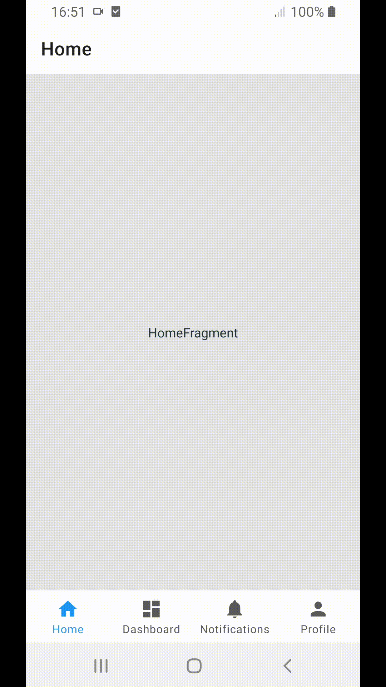

# Android Bottom Navigation
This application is example of how to use [BottomNavigationView](https://developer.android.com/reference/com/google/android/material/bottomnavigation/BottomNavigationView).
* Implement `com.google.android.material.bottomnavigation.BottomNavigationView`
* This app is implemented in Kotlin
* Disable BottomNavigationView shift mode.  

## Demo



## Prerequisites
* Android SDK 31
* Android Build Tool 30.0.2
* Androidx 1.2.1
* Android Plugin for Gradle 7.1.3
* Kotlin gradle plugin 1.6.21

## Getting Started
Build with Android Studio 4.1

## Disable shifting mode
### Since Support library 28

```xml
    <android.support.design.widget.BottomNavigationView
        ・・・
        app:labelVisibilityMode="labeled"
        ・・・
    />
```

### Support library 27 

```java
bottomNavigationView.disableShiftMode()
```

You need to configure proguard-rules.pro file if you want use ProGuard. Such as below:   

```
-keepclassmembers class android.support.design.internal.BottomNavigationMenuView { 
    boolean mShiftingMode; 
}
```
